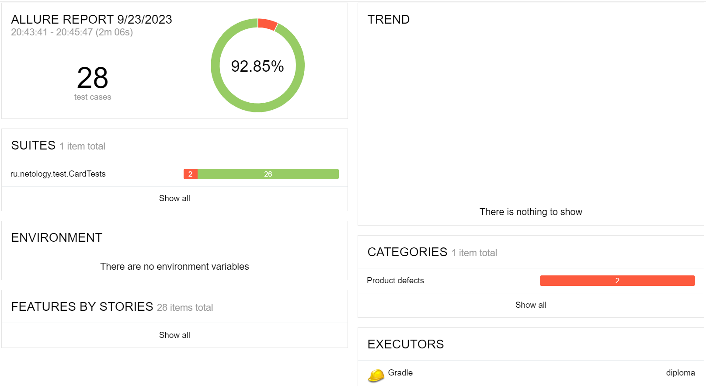
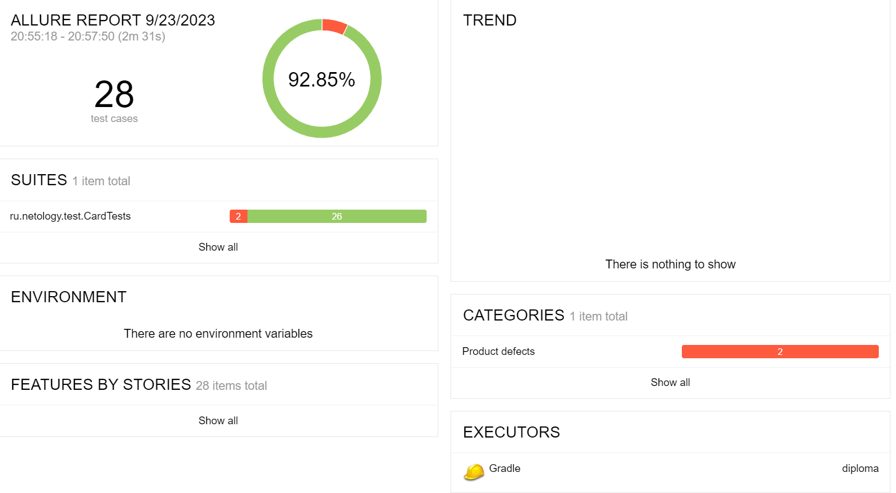

# Отчёт по результатам автоматического тестирования
## Краткое описание
В рамках данной дипломной работы была проведена автоматизация позитивных и негативных сценариев тестирования:

- Тестирование с валидными значениями во всех полях форм PaymentGate/CreditGate.
- Тестирование с невалидными значениями поочередно в каждом поле форм PaymentGate/CreditGate.
- Тестирование с обращением в базы данных.
- Тестирование отправки форм с пустыми полями.

Тестирование проведено с обращением в две базы данных - **MySQL** и **PostgreSQL**:

- Количество тест-кейсов: 28 сценариев тестирования для каждой БД.

1. Результаты тестирования для БД **MySQL**:

- успешные тесты: **26 шт.**
- неуспешные тесты: **2 шт.**

2. Результаты тестирования для БД **PostgreSQL**:

- успешные тесты: **26 шт.**
- неуспешные тесты: **2 шт.**

## Дефекты
**Дефекты**, обнаруженные при тестировании, оформлены как баг-репорты в **GitHub Issues.**

## Используемое окружение
1. Java 11
2. IntelliJ IDEA
3. Git Bash
4. Git Hub
5. Issues
6. JUnit 5
7. Selenide
8. Lombok
9. Faker
10. Gradle
11. Page Object
12. Docker Desktop
13. Allure
14. Браузер Chromium Версия 114.0.5735.0 (Сборка для разработчиков), (64 бит)

